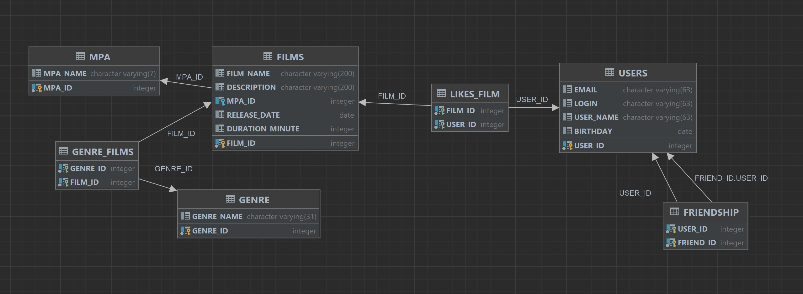

# java-filmorate
Схема БД

#Запрос поиска фильмов по жанру
SELECT film_name /n
FROM films f
LEFT JOIN ganre_film gf on f.film_id = gf.film_id 
LEFT JOIN ganre g on g.ganre_id = gf.film_id 
WHERE ganre_name = "Комедия"

