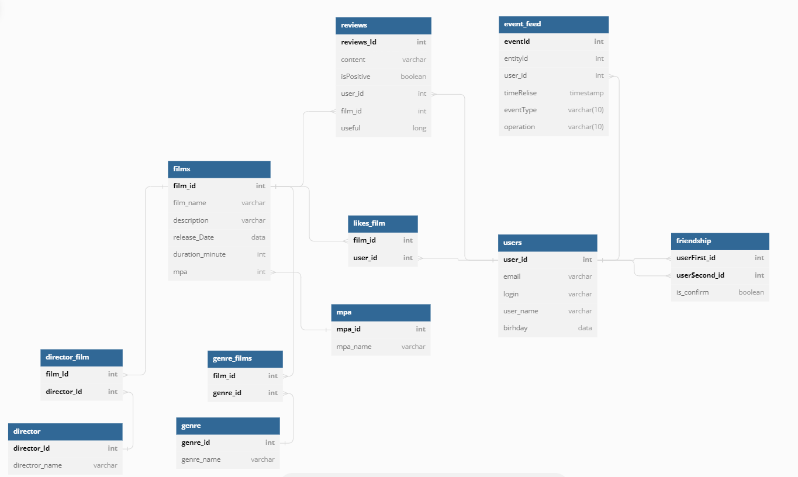

# java-filmorate

## Схема БД

## Функционал программы, реализованный в рамках группового проекта

### Добавление режиссёров в фильмы

В информацию о фильмах добавлена имя режиссёра.
Дополнительные методы:

1. Вывод всех фильмов режиссёра, отсортированных по количеству лайков.
2. Вывод всех фильмов режиссёра, отсортированных по годам.

### Удаление фильмов и пользователей

Добавлена функциональность для удаления фильмов и пользователей по id.

### Рекомендации

Реализована простая рекомендательная система для фильмов. Примерный алгоритм выглядит следующим образом:

1. Найти пользователей с максимальным количеством пересечения по лайкам.
2. Определить фильмы, которые один пролайкал, а другой нет.
3. Рекомендовать фильмы, которым поставил лайк пользователь с похожими вкусами, а тот, для кого составляется
   рекомендация,
4. ещё не поставил.

### Общие фильмы

Реализован вывод общих с другом фильмов с сортировкой по их популярности.

### Отзывы

В приложении появились отзывы на фильмы. Добавленные отзывы имеют рейтинг и несколько дополнительных характеристик

### Лента событий

Добавлена возможность просмотра последних событий на платформе — добавление в друзья, удаление из друзей, лайки и
отзывы,
которые оставили друзья пользователя.

### Поиск

Нужно реализовать поиск по названию фильмов и по режиссёру.
Алгоритм должен уметь искать по подстроке. Например, вы вводите ****«****крад****»****, а в поиске возвращаются
следующие
фильмы: ****«****Крадущийся тигр, затаившийся дракон****»****, ****«****Крадущийся в ночи****»**** и другие.

### Вывод самых популярных фильмов по жанру и годам

Добавить возможность выводить топ-N фильмов по количеству лайков.
Фильтрация должна быть по двум параметрам.

1. По жанру.
2. За указанный год.